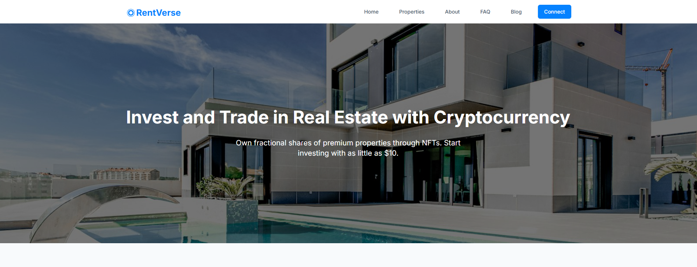
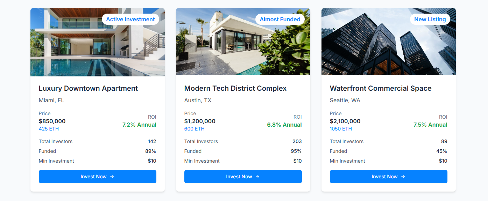

<!-- ⚠️ Best viewed in VS Code Markdown Preview -->
<!-- In GitHub this file may look unformatted or misaligned -->

<div align="center" style="font-size:28px; font-weight:700; color:#4ec9b0;">
✨ RentVerse ✨
</div>

---

<div align="center" style="font-size:18px; font-weight:700; color:#aaaaaa;">
RentVerse is a modern real estate investment platform that combines traditional property investing with cryptocurrency payments. Built with React and Tailwind CSS, it mirrors the functionality of Arrived.com while adding blockchain-based transaction capabilities.
</div>

---

---

# 🌐 RentVerse Demo
---

RentVerse is a demo platform showcasing a next-generation real-estate experience powered by cryptocurrency payments, interactive 3D property visualization, and a fully responsive, component-driven architecture.

---

## ✨ Key Features

- 💱 Cryptocurrency-enabled property transactions  
- 📱 Mobile-responsive interface  
- 🔍 SEO-optimized architecture  
- 📊 Real-time market data integration  
- 🏡 Interactive 3D property visualization  
- 🔗 Smart contract integration for secure blockchain transactions  

---


---

---

## 🧩 Core Pages and Components

### 1. 🏠 Home Page
- Hero section with value proposition  
- Featured properties grid  
- “Why Choose Us” crypto benefits section  
- Step-by-step investment guide  
- Latest blog previews  
- Community section  

### 2. 🏘️ Properties Page
- Searchable and filterable property grid  
- Advanced search options  
- Detailed property cards  
- Three.js-powered 3D viewer  

### 3. 👥 About Us Page
- Mission and vision overview  
- Team member profiles  
- Platform statistics and milestones  

### 4. ✍️ Blog Section
- Category-based filtering  
- Blog search functionality  
- Author profiles  
- Social sharing options  

---

## 🧱 Development Guidelines

### 🧩 Component Standards
- Follow atomic design principles  
- Use TypeScript for type safety  
- Apply Tailwind breakpoints for responsiveness  
- Add comments and maintain documentation  

### 🔧 State Management
- React Context for shared global state  
- Redux for complex or multi-layered data flows  
- Minimal local component state  

### 🔐 Security Practices
- Validate all user inputs  
- Secure wallet connection handling  
- Follow blockchain transaction best practices  
- Run regular dependency and security audits  

---

## 🤝 Contributing

We welcome contributions! Please follow the workflow below:

1. 📌 Create a new feature branch  
2. 🧪 Write tests for added functionality  
3. 📝 Document new or updated features  
4. 🎯 Maintain consistent coding style  
5. 🔁 Submit a pull request with a clear description  

---

## 🙏 Acknowledgments

Inspired by Arrived.com and supported by the open-source work of the React and Tailwind CSS communities.

---

# How to run the project

## Clone

```
   https://gitlab.com/silverbusiness2/rentverse-demo.git
```

## Change directory

```
   cd rentverse-demo
```

## Install dependencies

```
   npm install
```

## Run on localhost

```
   npm start
```
